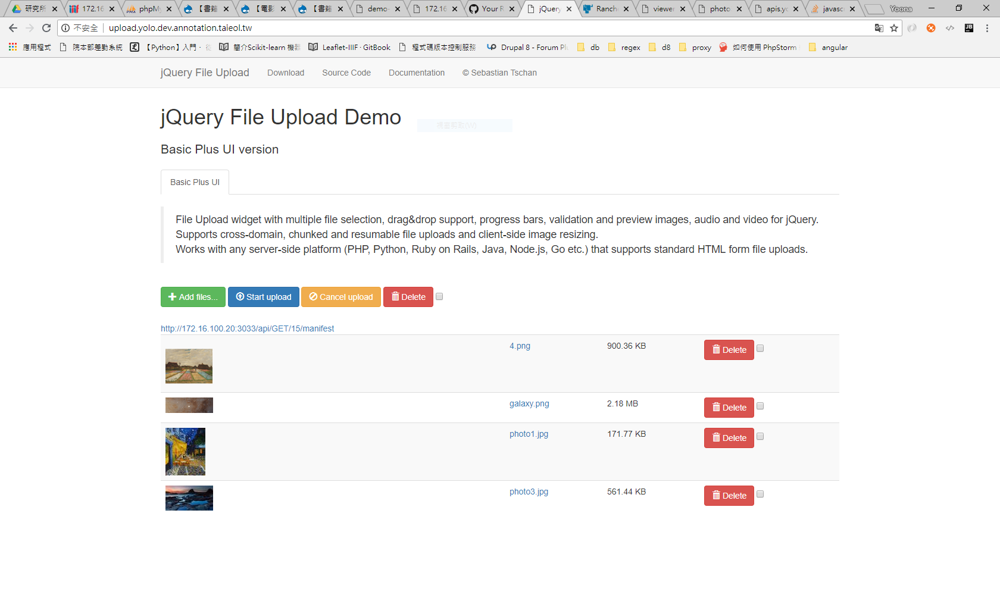

# jQuery File Upload Plugin

## Features
* **Multiple file upload:**  
  Allows to select multiple files at once and upload them simultaneously.
* **Drag & Drop support:**  
  Allows to upload files by dragging them from your desktop or filemanager and dropping them on your browser window.
* **Upload progress bar:**  
  Shows a progress bar indicating the upload progress for individual files and for all uploads combined.
* **Cancelable uploads:**  
  Individual file uploads can be canceled to stop the upload progress.
* **Resumable uploads:**  
  Aborted uploads can be resumed with browsers supporting the Blob API.
* **Chunked uploads:**  
  Large files can be uploaded in smaller chunks with browsers supporting the Blob API.
* **Client-side image resizing:**  
  Images can be automatically resized on client-side with browsers supporting the required JS APIs.
* **Preview images, audio and video:**  
  A preview of image, audio and video files can be displayed before uploading with browsers supporting the required APIs.
* **No browser plugins (e.g. Adobe Flash) required:**  
  The implementation is based on open standards like HTML5 and JavaScript and requires no additional browser plugins.
* **Graceful fallback for legacy browsers:**  
  Uploads files via XMLHttpRequests if supported and uses iframes as fallback for legacy browsers.
* **HTML file upload form fallback:**  
  Allows progressive enhancement by using a standard HTML file upload form as widget element.
* **Cross-site file uploads:**  
  Supports uploading files to a different domain with cross-site XMLHttpRequests or iframe redirects.
* **Multiple plugin instances:**  
  Allows to use multiple plugin instances on the same webpage.
* **Customizable and extensible:**  
  Provides an API to set individual options and define callback methods for various upload events.
* **Multipart and file contents stream uploads:**  
  Files can be uploaded as standard "multipart/form-data" or file contents stream (HTTP PUT file upload).
* **Compatible with any server-side application platform:**  
  Works with any server-side platform (PHP, Python, Ruby on Rails, Java, Node.js, Go etc.) that supports standard HTML form file uploads.

### Custom Backends
Using Node.js to handle upload.
Refer to https://github.com/johnny12150/img-upload-server

## License
Released under the [MIT license](https://opensource.org/licenses/MIT).

## Custom function gallery

## Often use URL in ascdc
* http://upload.yolo.dev.annotation.taieol.tw/
